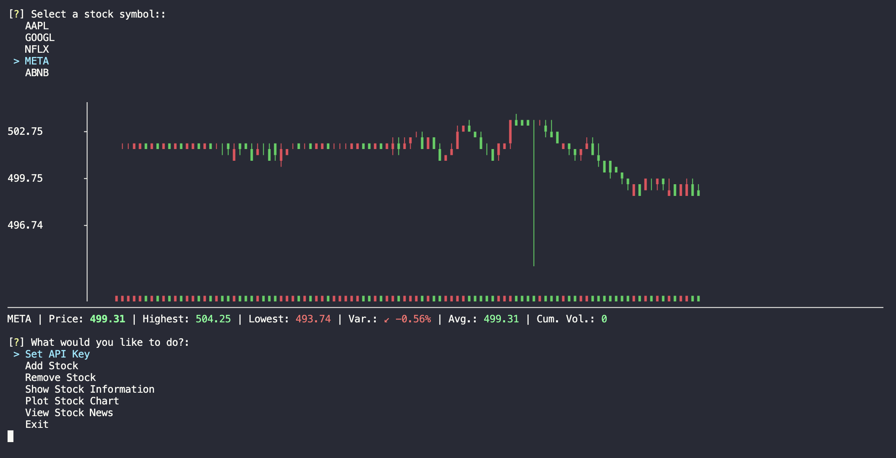

# 📟 Stock Console

Welcome to the Stock Management System, a Python application for managing stocks and retrieving stock data and news from the Alpha Vantage API.



## Table of Contents
- [📟 Stock Console](#-stock-console)
  - [Table of Contents](#table-of-contents)
  - [Overview](#overview)
  - [Prerequisites](#prerequisites)
  - [Getting Started](#getting-started)
  - [Usage](#usage)

## Overview

The Stock Management System allows users to interact with the Alpha Vantage API to perform various tasks related to stock management. It provides functionalities such as setting the API key, adding and removing stocks, viewing stock information, plotting stock charts, and accessing stock news.

## Prerequisites

Before using the application, ensure you have the following installed:

- Python 3.x
- colorama (can be installed via pip: `pip install colorama`)
- inquirer (can be installed via pip: `pip install inquirer`)

## Getting Started

1. **Clone the repository:**

    ```bash
    git clone https://github.com/lambiengcode/stockcon.git
    ```

2. **Navigate to the project directory:**

    ```bash
    cd stockcon
    ```

3. **Install dependencies:**

    ```bash
    pip3 install .
    ```

4. **Set up your API key:**
   - Obtain an API key from the [Alpha Vantage website](https://www.alphavantage.co/support/#api-key).
   - Set API key

    ```bash
    stockcon
    ```

    ```bash
    [?] What would you like to do?: 
    >   Set API Key
        Add Stock
        Remove Stock
        Show Stock Information
        Plot Stock Chart
        View Stock News
        Exit

    Enter your API key: 
    ```

## Usage

To run the application, execute the following command:

```bash
stockcon

[?] What would you like to do?: 
 > Set API Key
   Add Stock
   Remove Stock
   Show Stock Information
   Plot Stock Chart
   View Stock News
   Exit
```

- Set API Key: Allows you to set your API key for accessing the Alpha Vantage API. You will be prompted to enter your API key, which will be saved securely for future use.
- Add Stock: Enables you to add a stock symbol to your watchlist. You will be asked to input the symbol of the stock you wish to add.
- Remove Stock: Lets you remove a stock symbol from your watchlist. You will be prompted to enter the symbol of the stock you want to remove.
- Show Stock Information: Displays information about a specific stock, including its symbol, last refreshed timestamp, interval, output size, and time zone. You will be prompted to select a stock symbol from your watchlist.
- Plot Stock Chart: Generates a candlestick chart for a selected stock symbol based on the intraday data retrieved from the Alpha Vantage API. You will be prompted to choose a stock symbol from your watchlist.
- View Stock News: Fetches and displays the latest news related to a selected stock symbol from the Alpha Vantage API. You will be prompted to select a stock symbol from your watchlist.